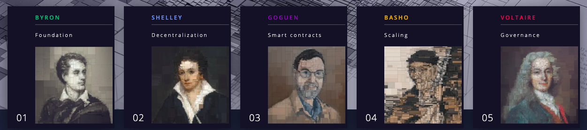

<style type="text/css">
body {          
max-width:100%;
padding:0;
}
</style>

```{r setup, include=FALSE}
knitr::opts_chunk$set(echo = TRUE)
```

# What Is Cardano?

Cardano is a decentralized third-generation **proof-of-stake** blockchain platform and home to the ada cryptocurrency. It is the first blockchain platform to evolve out of a scientific philosophy and a research-first driven approach.

Cardano is developing a **smart contract platform** which seeks to deliver more advanced features than any protocol previously developed. The development team consists of a large global collective of expert engineers and researchers. The protocol reportedly features a layered blockchain software stack that is **flexible**, **scalable** and is being developed with the most rigorous academic and commercial software standards in the industry. 

Cardano's roadmap for development has been divided into five eras: Byron, Shelley, Goguen, Basho and Voltaire. While each separate era has its own set of functionalities that will be developed and supported in multiple code releases in a sequential order, the development of each era is parallel and simultaneous across the different systems. Cardano also has its own block explorer, which allows users to check the history of ADA transactions that are publicly recorded on the blockchain.

```{r , echo=FALSE, fig.align="center", fig.cap="Cardano Roadmap", out.width = '100%'}

```

# How can I store Cardano?

 It is highly recommended to avoid keeping your cryptocurrency in an exchange longer than necessary, and instead to use a cryptocurrency wallet. We recommend either a full-node wallet like [Daedalus](https://daedaluswallet.io/), or the browser-based [Yoroi](https://yoroi-wallet.com/#/).
