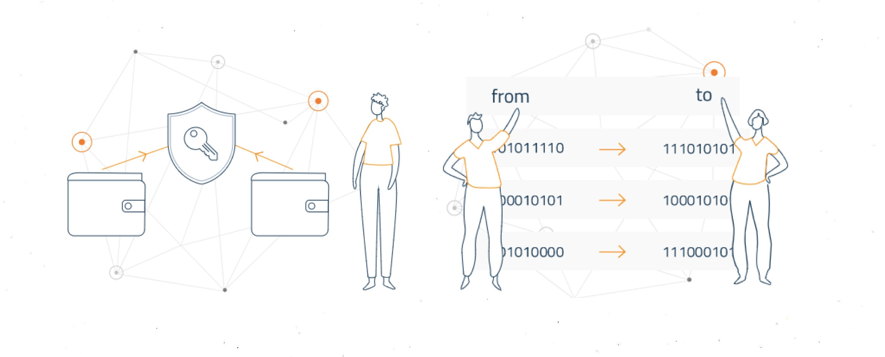
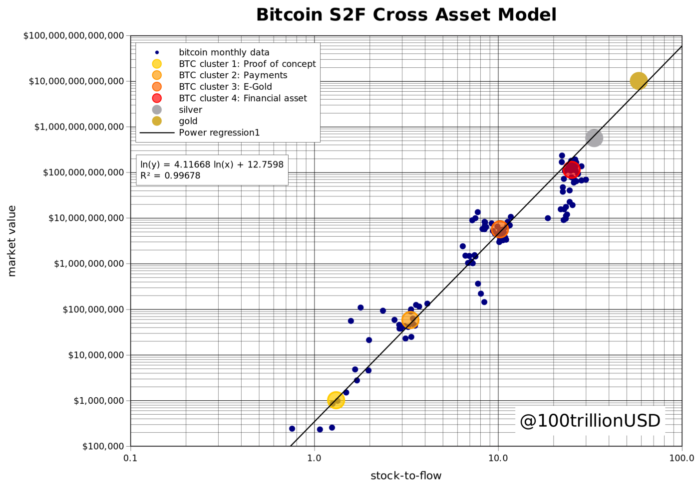
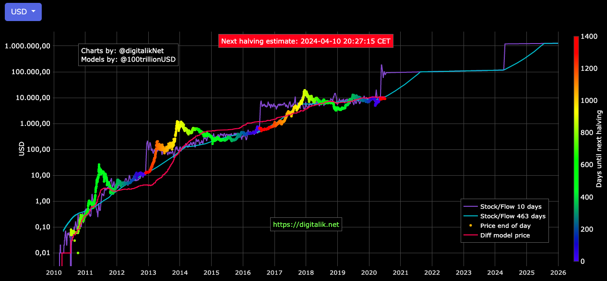

<style type="text/css">
body {          
max-width:100%;
padding:0;
}
</style>

```{r setup, include=FALSE}
knitr::opts_chunk$set(echo = TRUE)
```

# What Is Bitcoin?
**[Bitcoin](https://bitcoin.org/en/) is a completely decentralized digital cryptocurrency**. Unlike US dollars that you can hold in your hand (or in your bank account), there is **no central authority** or centralized payment system controlling Bitcoin. Instead, Bitcoin operates in a **peer-to-peer network** that allows anyone in the world to send and receive Bitcoin without any middleman (like a bank, central bank or payment processor).

Although there are thousands of cryptocurrencies ranked on CMC today, **Bitcoin was the very first cryptocurrency ever created**. On Oct. 31, 2008 a person (or group of people) under the pseudonym “Satoshi Nakamoto” published the now-world famous  [Bitcoin white paper](https://bitcoin.org/bitcoin.pdf).

The first line reads: 

> A purely peer-to-peer version of electronic cash, which would allow online payments to be sent directly 
> from one party to another without going through a financial institution. 

# How Does Bitcoin Work?
**Bitcoin is a purely decentralized digital currency**. Before the digital age, everyone transacted in physical forms of currencies, from livestock and salt, to silver and gold, and finally to banknotes. Only in recent times was money “digitized” — allowing bank accounts to exist online, as well as creating the many online payment processing platforms, such as PayPal and Square, that you often use today without thinking about it. However, all of these “digital transactions” require a centralized system to operate. Your bank, or financial services like PayPal, needs to ensure that all of their users’ accounts are constantly updated and tallied correctly. These systems represent the centralized form of digital money.

**Bitcoin revolutionized digital money by decentralizing this accounting process**. Instead of a central figure that is responsible for making sure that their users’ transactions were always adding up, Bitcoin works by sharing the account balances and transactions of every user across the globe in a pseudonymous form. 

In simplest terms, this means that anyone can download and run the free and open-source software required to participate in the Bitcoin protocol. This public open-source software is called **block chain** and is a shared public ledger on which the entire Bitcoin network relies. All confirmed **transactions** (transfer of value between Bitcoin wallets) are included in the block chain.

Bitcoin wallets keep a secret piece of data called a **private key** or seed, which is used to sign transactions, providing a mathematical proof that they have come from the owner of the wallet. The signature also prevents the transaction from being altered by anybody once it has been issued. All transactions are broadcast to the network and usually begin to be confirmed within 10-20 minutes, through a process called mining.

As a Bitcoin user, all you need to know to send Bitcoin to someone else is their Bitcoin address (a series of letters and numbers, not their name or any personal information). By sending your Bitcoin to an address "A", what you are doing is broadcasting your transaction across the Bitcoin network using blockchain technology. 

In summary, Bitcoin works by ensuring that this shared ledger always tallies up, and that new Bitcoin transactions are validated, recorded and then added to the ledger in order. That is the heart of blockchain technology, where **new “blocks of information” are added to the chain of blocks that already exist.**
```{r , echo=FALSE, fig.align="center", fig.cap="", out.width = '80%'}

```

# How Does Bitcoin Mining Work?

**Mining is a distributed consensus system that is used to confirm pending transactions by including them in the block chain, in other words it refers to the act of adding new blocks to the blockchain**. In simple terms, Bitcoin miners dedicate significant amounts of computing power to solve a cryptographic problem, which is basically a very complex puzzle. The successful miner that solves the puzzle before all the other miners gets rewarded with a “block reward,” which is an allocation of a predetermined number of Bitcoin. In some cases, the block rewards are awarded to mining pools, when miners group together to share resources.

Once the puzzle is solved, the block is “confirmed,” and it is added to the blockchain. This new information is sent to all nodes, i.e. participants in the Bitcoin protocol, and the shared ledger is updated once again. A new block is generated roughly every 10 minutes.

As Bitcoin's price rises, the block reward becomes increasingly more attractive. This incentivizes more miners to join in the competition to mine for blocks. In return, the more miners there are in the system, the more secure the network is. In addition, the increased competition also means miners are continually investing in newer hardware to ensure their computing power remains relevant for the fight for block rewards.

# How Can I Store my Bitcoin?
There are many different ways of storing your Bitcoin – here’s just a few:

- **Keep it on a Bitcoin exchange**: There are many Bitcoin different exchanges all over the world. All of these exchanges allow you to sell Bitcoin for other cryptocurrencies (altcoins) or government currencies (USD, EUR, GBP etc.) At the same time, these Bitcoin exchanges allow you to store your BTC with them, which means that the burden of keeping it safe is on them. Do note that incidents have occurred when exchanges have been hacked or lost their customers’ BTC, so do your own research when you’re looking for an exchange that’s safe to hold your cryptoassets. For the latest list of exchanges and trading pairs for this cryptocurrency, click on our market pairs tab.
- **Keep it in a Bitcoin wallet**: Instead of keeping it on a Bitcoin exchange, you could keep your Bitcoin in a Bitcoin wallet instead. Wallets come in two forms 
- **Hot wallets** are software that stays connected to the internet, aka storing your Bitcoin online. It is more convenient to transact via a hot wallet, but they logically are more susceptible to being attacked, as they stay connected to the internet. 
- **Cold wallets** are wallets that are not “online.” They are less prone to attack, as hackers cannot access this type of cold storage via the internet, but they are also a lot less convenient for the user as they may be cost-prohibitive and require more technical understanding to operate. Examples of cold wallets are hardware wallets and paper wallets.


# Scarcity
**Bitcoin is the first scarce digital object the world has ever seen**. Bitcoin has unforgeable costliness, because it costs a lot of electricity to produce new bitcoins.It is not possible to copy or forge Bitcoins, and the total supply is strictly limited (21 million BTC). That is where "scarcity" comes into play. The dictionary definition of scarcity is when something is difficult to come across in nature or in the lab; very similarly to precious metals. Once something becomes scarce enough, it can be used as a money.

So, scarcity can be quantified by stock to flow.
$$ SF = stock / flow $$
Stock is the size of the existing stockpiles or reserves. Flow is the yearly production. It tells us how many years are required, at the current production rate, in order to produce what's in the current stock.

```{r , echo=FALSE, fig.align="center", fig.cap="Stock to flow comparison between different assets", out.width = '50%'}

```

**Supply of bitcoin is fixed**. New bitcoins are created in every new block. Blocks are created every 10 minutes (on average), when a miner finds the hash that satisfies the PoW required for a valid block. The first transaction in each block, called the coinbase, contains the block reward for the miner that found the block. The block reward consists of the fees that people pay for transactions in that block and the newly created coins (called subsidy). **The subsidy started at 50 bitcoins, and is halved every 210,000 blocks (about 4 years)**. That's why 'halvings' are very important for bitcoins money supply and SF. 

```{r , echo=FALSE, fig.align="center", fig.cap="Stock to flow of BTC in time", out.width = '60%'}

```


A model for BTC S/F in time can be found in the article [Modeling Bitcoin Value with Scarcity](https://medium.com/@100trillionUSD/modeling-bitcoins-value-with-scarcity-91fa0fc03e25), while an updated cross stock to flow model (comparing assets like gold and silver) and be found in the more recent article [Bitcoin Stock-to-Flow Cross Asset Model](https://medium.com/@100trillionUSD/bitcoin-stock-to-flow-cross-asset-model-50d260feed12).