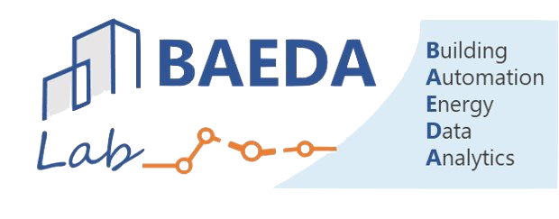

<!-- PROJECT LOGO -->
<br />
<p align="center">
  <a href="https://www.researchgate.net/lab/Building-Automation-and-Energy-Data-Analytics-Lab-Alfonso-Capozzoli">
    
  </a>

  <h3 align="center">BAEDA Data Analytics</h3>

  <p align="center">
    Provides an easy R data analytics tool to inspect data frames and perform complex analysis
    <br />
    <a href="https://github.com/RobertoChiosa/BAEDA_data_analytics"><strong>Explore the docs »</strong></a>
    <br />
    <br />
    <a href="https://github.com/RobertoChiosa/BAEDA_data_analytics">View Demo</a>
    ·
    <a href="https://github.com/RobertoChiosa/BAEDA_data_analytics/issues">Report Bug</a>
    ·
    <a href="https://github.com/RobertoChiosa/BAEDA_data_analytics/issues">Request Feature</a>
  </p>
</p>

<!-- ABOUT THE PROJECT -->
## About The Project

Here's a blank template to get started:
**To avoid retyping too much info. Do a search and replace with your text editor for the following:**
`RobertoChiosa`, `BAEDA_data_analytics`, `twitter_handle`, `roberto.chiosa@gmail.com`


<!-- GETTING STARTED -->
## Getting Started

To get a local copy up and running follow these simple steps.

### Prerequisites

This is an example of how to list things you need to use the software and how to install them.
* npm
```sh
npm install npm@latest -g
```

<!-- LICENSE -->
## License

Distributed under the MIT License. See `LICENSE` for more information.


<!-- CONTACT -->
## Contact

Your Name - [@twitter_handle](https://twitter.com/twitter_handle) - roberto.chiosa@gmail.com

Project Link: [https://github.com/RobertoChiosa/BAEDA_data_analytics](https://github.com/RobertoChiosa/BAEDA_data_analytics)


<!-- ACKNOWLEDGEMENTS -->
## Acknowledgements

* []()
* []()
* []()


<!-- MARKDOWN LINKS & IMAGES -->
<!-- https://www.markdownguide.org/basic-syntax/#reference-style-links -->
[contributors-shield]: https://img.shields.io/github/contributors/RobertoChiosa/repo.svg?style=flat-square
[contributors-url]: https://github.com/RobertoChiosa/repo/graphs/contributors
[forks-shield]: https://img.shields.io/github/forks/RobertoChiosa/repo.svg?style=flat-square
[forks-url]: https://github.com/RobertoChiosa/repo/network/members
[stars-shield]: https://img.shields.io/github/stars/RobertoChiosa/repo.svg?style=flat-square
[stars-url]: https://github.com/RobertoChiosa/repo/stargazers
[issues-shield]: https://img.shields.io/github/issues/RobertoChiosa/repo.svg?style=flat-square
[issues-url]: https://github.com/RobertoChiosa/repo/issues
[license-shield]: https://img.shields.io/github/license/RobertoChiosa/repo.svg?style=flat-square
[license-url]: https://github.com/RobertoChiosa/repo/blob/master/LICENSE.txt
[linkedin-shield]: https://img.shields.io/badge/-LinkedIn-black.svg?style=flat-square&logo=linkedin&colorB=555
[linkedin-url]: https://linkedin.com/in/RobertoChiosa
[product-screenshot]: README_images/screenshot.png
[product-roadmap]: README_images/roadmap.png